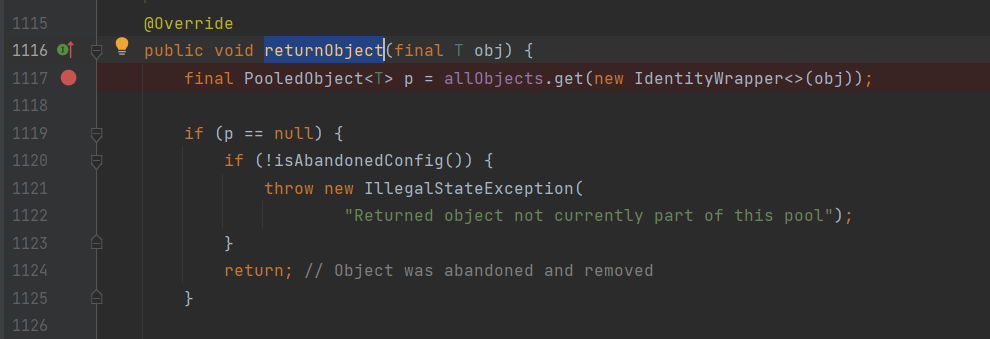

# Jdbi3 Bug - Object Stuck In a Pool
This repository contains a reproducer for a potential bug in jdbi3-core library that can
lead to keeping closed DB connections in connection pool. This eventually will made pool to be 
exhausted. The bug was reported in [jdb3 issue](https://github.com/jdbi/jdbi/issues/2446)

The "stuck", closed connections are marked as "Allocated" and they are never returned to the pool.
Hence, they are never cleaned by the pool nor reused.

# Root cause
The issue happens when underlying DB connection is closed (Server or client side) just after 
borrowing it from pool and before Jdbi3 [Handle](https://github.com/jdbi/jdbi/blob/master/core/src/main/java/org/jdbi/v3/core/Handle.java) is created.

Every Handle object has a `Cleanable` associated with it that will be executed whenever 
`Handle::close()` is called. This will eventually delegate to underlying pool that will destroy or 
return the connection object to the pool.

However, in Handle's constructor there is a check, that verifies if used connection for this 
handle is `live`. The `Cleanable` is added to the Handle instance ONLY if connection is live.

```java
addCleanable(() -> {
            // shut down statement builder
            if (checkConnectionIsLive()) {
                statementBuilder.close(connection);
            }
        });
```

If the connection was closed or had any connection issue after it was 
borrowed from the pool and before this check, then no Cleanable will be registered making this 
object never be returned to the pool.

# Reproducer
This repository contains a simple Junit test that can be used to recreate the problem using 
debug mode and properly placed break points. This tests uses Postgresql databased ran using 
TestContainers extension. The test will execute number of `SELECT` calls to the database.
The 7th call will hang on connection pool. Pool size used in test is 6.

## Prerequisites
- Java 11
- Docker Engine

## Steps to reproduce
1. Ensure that breakpoints in your IDE are set to block thread only and not the entire JVM.
2. Clone repository and import it as a maven project to IDE.

## Negative path object stuck in a pool
1. Open [Jdbi3IntegrationTest](src/test/java/org/example/Jdbi3IntegrationTest.java) and put 
   breakpoint at line 43, where `selectFromDb();` method is called.
   
2. Open `PoolingDataSource` class from `commons-dbcp2` dependency and add two breakpoints in 
   `getConnection` method on lines 141 and 142. </br>
   
3. Start `Jdbi3IntegrationTest::testMe()` test in debug mode.
   
4. Resume program to the next Breakpoint which would be 1st BP in 
   `PoolingDataSource::getConnection` 
   method. At this stage we can inspect the pool and see that there are no objects in the pool.
   
5. Move to the next BP, line bellow and evaluate an expression in debug mode `((PoolableConnection) 
   conn).connection.close();`
   This will emulate a "Network issue" on the connection object.
   
6. Inspect the pool again, and we can see that now it contains one connection object that is 
   `ALLOCATED` and it is also `closed`.
   
7. Resume program. You should get an exception in console ```org.jdbi.v3.core.ConnectionException: org.postgresql.util.PSQLException: This connection has been closed.```
8. Repeat steps 4 - 7 multiple times. Remember to call ```((PoolableConnection) conn).
   connection.close();``` on connection object returned from the pool in step 6. Each time you can 
   see that new connection object was created and old objects are never cleared from the pool or reused since they are still in 
   `ALLOACTED` state. They were never returned to the pool.
   
9. On the 7th try the program will hang on `pool.borrowObject()` call since pool is exhausted.
   

Optionally you can also put a breakpoint in Handle object in line 121. You will see then, that 
after step 7th, no `Cleanable` will be registered on created Handle because of connection 
livecheck. 

## Happy Path
- Add extra breakpoint in `GenericObjectPool::returnObject` method from `commons-pool2` library.
  
- Repeat all steps from [Negative path](#negative-path-object-stuck-in-a-pool)
but do NOT evaluate expression from step 5.
- Eventually you will hit BP from `returnObject` method that was triggered by processing 
  `Cleanable` registered on created `Handle` instance.


# Issues
```java
java.lang.IllegalStateException: Could not find a valid Docker environment. Please see logs and check configuration
```
Make sure that you have Docker engine started on your machine.

